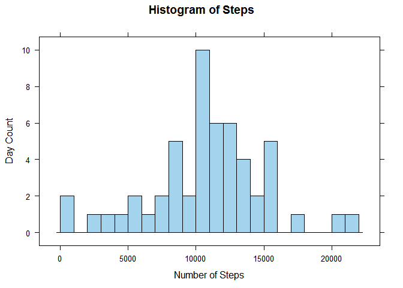
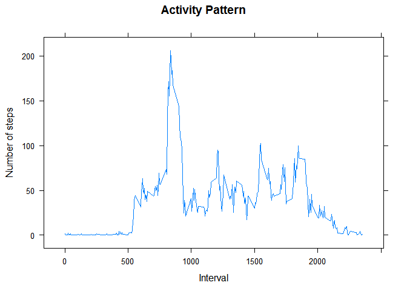
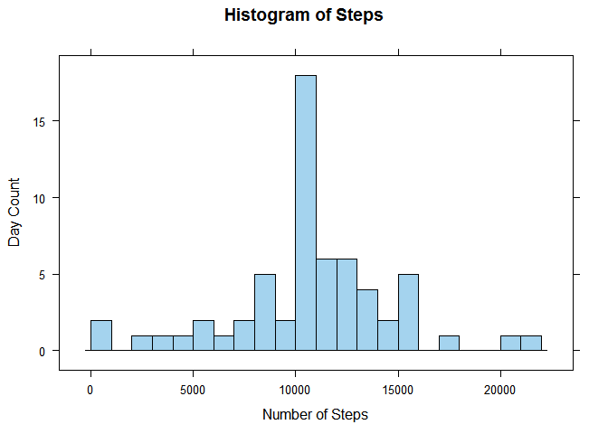

# Reproducible Research: Peer Assessment 1

##Introduction
The document contains the analysis of the activity data as part of coursera Data Science course - Reproducible Research. It contains the project questions, explanations and R code with output to support the conclusion.

## Loading and preprocessing the data


```r
activity_raw <- read.csv("../data/activity.csv")
summary(activity_raw)
```

```
##      steps                date          interval     
##  Min.   :  0.00   2012-10-01:  288   Min.   :   0.0  
##  1st Qu.:  0.00   2012-10-02:  288   1st Qu.: 588.8  
##  Median :  0.00   2012-10-03:  288   Median :1177.5  
##  Mean   : 37.38   2012-10-04:  288   Mean   :1177.5  
##  3rd Qu.: 12.00   2012-10-05:  288   3rd Qu.:1766.2  
##  Max.   :806.00   2012-10-06:  288   Max.   :2355.0  
##  NA's   :2304     (Other)   :15840
```

```r
head(activity_raw)
```

```
##   steps       date interval
## 1    NA 2012-10-01        0
## 2    NA 2012-10-01        5
## 3    NA 2012-10-01       10
## 4    NA 2012-10-01       15
## 5    NA 2012-10-01       20
## 6    NA 2012-10-01       25
```
The file contains many NA values and the following code separates the NA values and use the clean data for calculation.

```r
isNAindex <- is.na(activity_raw$steps)
act_NoNA <- activity_raw[(!isNAindex),]
act_NA <-  activity_raw[isNAindex,]
```

## What is mean total number of steps taken per day?
The following code calculates the total number of steps per day by aggregating the steps, displays histogram and calculate mean/median.  
1. Calculation of total steps per day

```r
StepsByDay <- aggregate(x = act_NoNA$steps, by = list(act_NoNA$date), 
              FUN = "sum")
names(StepsByDay) <- c("date", "steps")
head(StepsByDay)
```

```
##         date steps
## 1 2012-10-02   126
## 2 2012-10-03 11352
## 3 2012-10-04 12116
## 4 2012-10-05 13294
## 5 2012-10-06 15420
## 6 2012-10-07 11015
```
2. Histogram of the steps per day

```r
library(lattice)
histogram(~steps,   data = StepsByDay, 
                    xlab = "Number of Steps",
                    ylab = "Day Count",
                    main = "Histogram of Steps",
                    type = "count",
                    col = "lightskyblue2",
                    breaks = 20)
```

 
   
3. Calculation of the Mean and Median

```r
StepsByDayMn <- c(Mean = round(mean(StepsByDay$steps),2),
                  Median = round(median(StepsByDay$steps),2))
StepsByDayMn
```

```
##     Mean   Median 
## 10766.19 10765.00
```
The mean is 10766.19 and the median is 10765.

## What is the average daily activity pattern?
The following code calculates the average steps per 5 minutes interval across all days.  
1. The Time series plot

```r
StepsByInt <- aggregate(x = act_NoNA$steps, 
                        by = list(act_NoNA$interval), 
                        FUN = "mean")
names(StepsByInt) <- c("interval", "steps")
StepsByInt$interval <- ts(StepsByInt$interval)
xyplot(steps ~ interval, data = StepsByInt, 
        type = "l", xlab = "Interval",
        ylab = "Number of steps",
        main = "Activity Pattern")
```

 
  
2. The maximum number of steps for an interval

```r
maxSteps <- StepsByInt[StepsByInt$steps == max(StepsByInt$steps),]
maxSteps
```

```
##     interval    steps
## 104      835 206.1698
```
The maximum number of steps is 206.17 for the interval time: 835.

## Imputing missing values
This section calculates the number of NAs in the dataset and replace the NAs with values with the calculated values.  
1. The following code identify and display the total number of NAs.

```r
summary(activity_raw)
```

```
##      steps                date          interval     
##  Min.   :  0.00   2012-10-01:  288   Min.   :   0.0  
##  1st Qu.:  0.00   2012-10-02:  288   1st Qu.: 588.8  
##  Median :  0.00   2012-10-03:  288   Median :1177.5  
##  Mean   : 37.38   2012-10-04:  288   Mean   :1177.5  
##  3rd Qu.: 12.00   2012-10-05:  288   3rd Qu.:1766.2  
##  Max.   :806.00   2012-10-06:  288   Max.   :2355.0  
##  NA's   :2304     (Other)   :15840
```

```r
isNAindex <- is.na(activity_raw$steps)
act_NoNA <- activity_raw[(!isNAindex),]
act_NA <-  activity_raw[isNAindex,]
dim(act_NA)
```

```
## [1] 2304    3
```
The total number of NAs is 2304.  

2. Missing data update strategy  
Based on the data analysis, I have decided to update the NA values with the average for the same interval across all days.  
3. Update NA data based on the strategy

```r
IntervalMean <- aggregate(x = act_NoNA$steps, 
                          by = list(act_NoNA$interval), FUN = "mean")
names(IntervalMean) <- c("interval", "steps2")
act_NAmerge <- merge(act_NA, IntervalMean)

act_NAnew <- data.frame(steps = act_NAmerge$steps2, 
                        date = act_NAmerge$date, 
                        interval = act_NAmerge$interval)

actAll <- rbind(act_NAnew, act_NoNA)
summary(actAll)
```

```
##      steps                date          interval     
##  Min.   :  0.00   2012-10-01:  288   Min.   :   0.0  
##  1st Qu.:  0.00   2012-10-02:  288   1st Qu.: 588.8  
##  Median :  0.00   2012-10-03:  288   Median :1177.5  
##  Mean   : 37.38   2012-10-04:  288   Mean   :1177.5  
##  3rd Qu.: 27.00   2012-10-05:  288   3rd Qu.:1766.2  
##  Max.   :806.00   2012-10-06:  288   Max.   :2355.0  
##                   (Other)   :15840
```

```r
dim(actAll)
```

```
## [1] 17568     3
```
4. Histogram and mean/median for the updated dataset

```r
StepsByDayall <- aggregate(x = actAll$steps, 
                           by = list(actAll$date),
                           FUN = "sum")
names(StepsByDayall) <- c("date", "steps")

histogram(~steps,   data = StepsByDayall, 
                    xlab = "Number of Steps",
                    ylab = "Day Count",
                    main = "Histogram of Steps",
                    type = "count",
                    col = "lightskyblue2",
                    breaks = 20)
```

 

```r
StepsByDayallMn <- c(Mean = mean(StepsByDayall$steps), 
  Median = median(StepsByDayall$steps))
StepsByDayallMn
```

```
##     Mean   Median 
## 10766.19 10766.19
```
  
We can see that there is minor change in the median value (10766.19) compared to the previous median (10765). But the average(10766.19) remains same.As the NA values are adjusted with the average value, that average remains unchanged.

## Are there differences in activity patterns between weekdays and weekends?
1. The following code creates a new factor variable for weekday and weekends

```r
wkday <- weekdays(as.Date(actAll$date))
wkday <- factor((( wkday == "Saturday") | ( wkday == "Sunday"))*1)
levels(wkday)[1] <- "weekday"
levels(wkday)[2] <- "weekend"
actAllwk <- data.frame(actAll, wkday)
```
2. The following code displays the line chart comparing weekend and weekdays steps for the interval

```r
actAllwkMean <- aggregate(x = actAll$steps, by = list(actAllwk$interval,actAllwk$wkday), FUN = "mean")
names(actAllwkMean) <- c("interval", "wkday", "steps")
xyplot(steps ~ interval | wkday, data = actAllwkMean, type = "l", layout = c(1,2))
```

 
